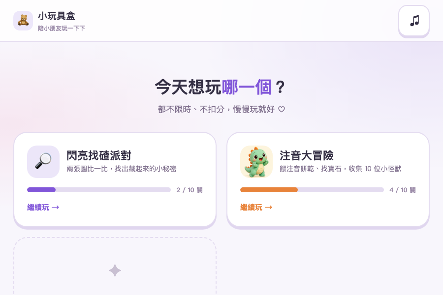
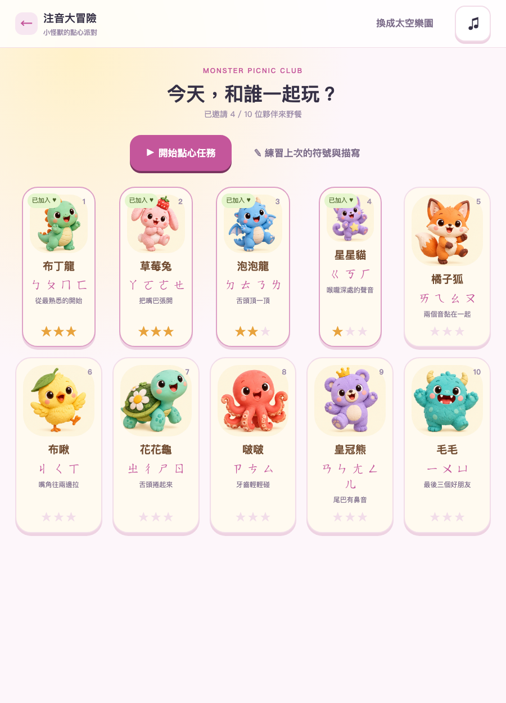
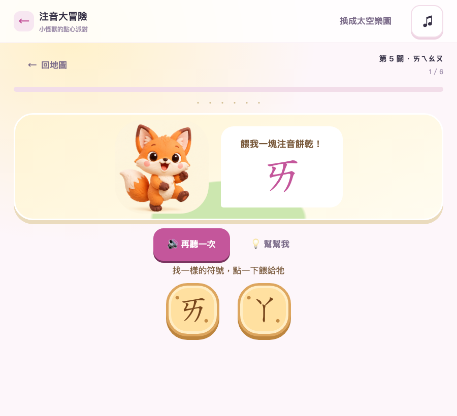
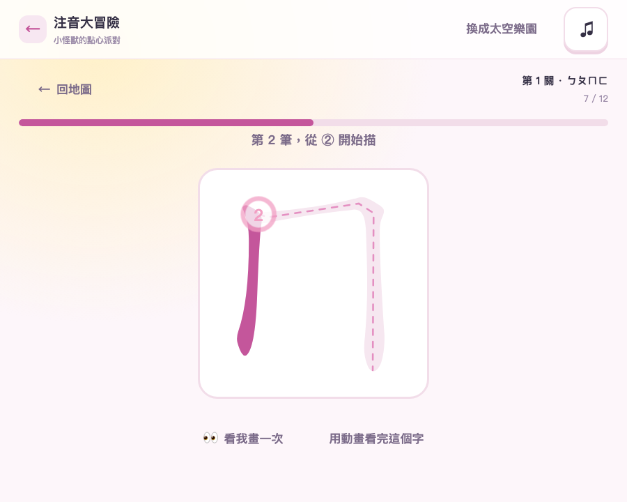
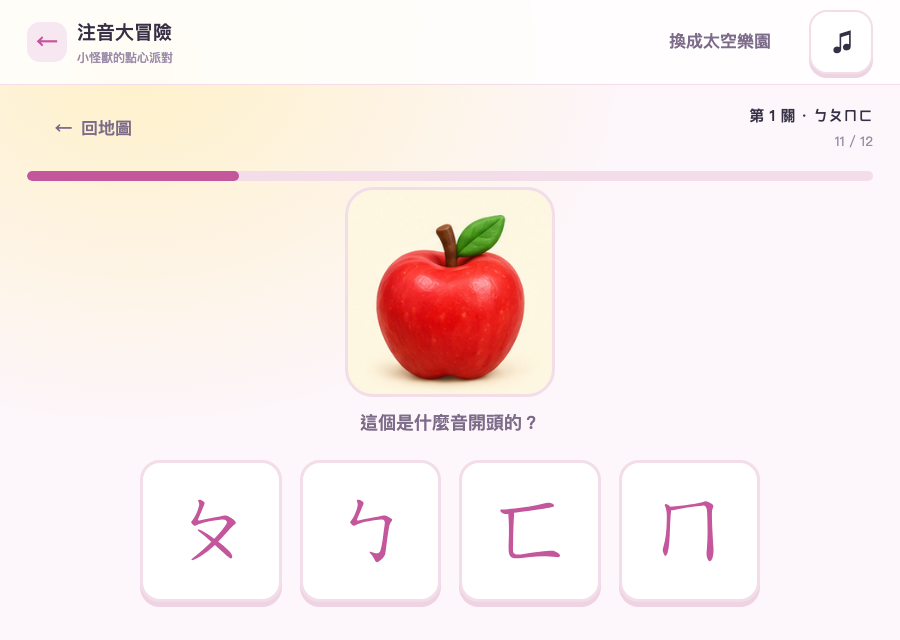
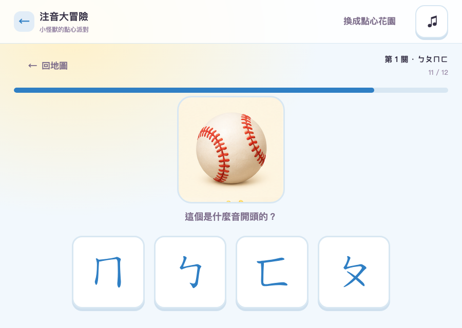

# 小玩具盒

給幼兒園小朋友（4-5 歲）的網頁小遊戲合輯。正體中文、台灣發音。
不用安裝、不用建置、不連網，`dist/index.html` 點兩下就能玩。

不倒數、不扣分、沒有失敗畫面。主要給平板用。



## 開始玩

```sh
open dist/index.html                            # 或直接點兩下
python3 -m http.server 4173 --directory dist    # 平板連 http://<電腦IP>:4173
```

## 注音大冒險

10 個單元涵蓋 37 個注音符號，每關住著一位夥伴。餵對餅乾、找到寶石，牠就來野餐。




跟著虛線描筆順。描歪了只是推不動，卡住會提示，再卡住就用動畫幫你描完，一樣給星星。



看圖配注音會先唸整個語詞，再問開頭是什麼音。兩個版本的配色與題目插畫完全不同：

| 點心花園 | 太空樂園 |
|---|---|
|  |  |

地圖上另有自選練習：認識一下 → 描一描 → 聽音／看圖 → 拼拼看。

**這一版不教聲調**（全部一聲），拼讀只做二拼。

## 閃亮找碴派對

十個場景，每關十個不同，左右兩張圖都能點。


## 設計重點

| | |
|---|---|
| 每句話都唸得出來 | 孩子還不識字，畫面上的字是給大人看的 |
| 點錯先唸出「他點到的那個」 | 只放嗶聲的話，他不知道自己按到什麼；點錯正是認識符號的時機 |
| 誘答項和單元脫鉤 | 單元照發音部位分組，那正好最容易混淆。最小對立只留給挑戰題 |
| 看圖題先唸整個語詞 | 消除命名歧義（🐶 是「狗」ㄍ 還是「小狗」ㄒ），也示範怎麼聽開頭音 |
| 描寫用弧長推進判定 | 不是「依序通過每個路徑點」—— 那個對這年紀會一直失敗 |
| 符號用筆畫資料畫，不用字型 | 字型的注音字形常和教育部標準字體有出入 |
| 觸控目標最小 64px | 主要作答按鈕 96px 以上 |

## 語音

預先產好的 132 個 m4a，不是瀏覽器即時語音合成。

| 用途 | 音源 |
|---|---|
| 37 個注音符號 | 教育部《國語注音符號手冊》真人錄音（CC BY 4.0） |
| 音節 / 語詞 / 介面 | macOS 內建台灣中文語音合成 |

```sh
./tools/make-audio.sh                 # 產生全部（需要 macOS）
./tools/make-audio.sh --say-symbols   # 沒網路時符號也退回合成音
```

`tools/audio-check.html` 可逐一試聽。

<details>
<summary>三個踩過的坑</summary>

- `speechSynthesis` **唸不出注音字元**（U+3105–U+3129 不是漢字，TTS 會當未知符號丟掉），
  而 **ㄈ ㄝ ㄟ ㄥ 沒有任何一聲的字可以代讀**，所以只能預先產檔。
- 教育部音檔的順序是「聲符 21 + **韻符 13** + 介符 3」，不是慣例的那個。
  F22 是ㄚ不是ㄧ。對照表在 `tools/moe-audio-map.tsv`，照慣例猜會錯 16 個。
- 拼讀音節用代表字產生。捲舌聲母配 ㄨ 時注音字串不會融合
  （`say "ㄓㄨ"` 0.486s vs `say "豬"` 0.324s，被唸成兩段）。

</details>

## 架構

```
dist/
├── index.html      主選單（卡片由 shared/catalog.js 產生）
├── shared/         shell.css core.js storage.js audio.js catalog.js
└── games/
    ├── spot/       找碴
    └── zhuyin/     注音（data/ modes/ audio/ assets/）
```

加新遊戲：開一個資料夾，在 `shared/catalog.js` 加一筆。

為了保住「點兩下就能玩」，`file://` 有幾個限制必須維持：

- 傳統 `<script defer>` + 全域 `window.Kid`，**不用 ES modules**（CORS 會擋）
- 資料寫成 inline JS，不用 `.json` + `fetch()`
- 音檔用 `new Audio()`，不用 Web Audio 的 `decodeAudioData`
- 路徑一律相對，連結寫到 `index.html` 不要只寫目錄
- 改了 `shared/` 記得把各頁 `?v=N` 往上加

找碴的右圖是同一張原圖疊十個橢圓遮罩，只露出變化版的局部，
所以重新生成圖片也不會帶進沒列在答案裡的差異。座標在 `differences.js`，
畫面變化、命中判定、提示圈共用同一份。

進度存在單一 key `kid-games-v1`，`sound` 跨遊戲共用。

## 開發

```sh
node --test tests/*.test.cjs
```

開發用頁面：`dist/games/zhuyin/preview.html`（六種玩法一次畫出來）、
`dist/games/spot/geometry-check.html`、`tools/audio-check.html`。

插畫全部 AI 生成，提示詞留在各 `assets/README.md`。圖片載入失敗會退回 Emoji。

## 授權

程式碼與文件採 [MIT](LICENSE)。另有兩份第三方素材不在 MIT 範圍：

| 素材 | 授權 | 出處 |
|---|---|---|
| 注音發音音檔 | CC BY 4.0 | [教育部《國語注音符號手冊》](https://language.moe.gov.tw/001/Upload/files/site_content/M0001/juyin/index.html) · [開放資料 44640](https://data.gov.tw/dataset/44640) |
| 注音字形與筆順 | LGPL-3.0-or-later | [animCJK](https://github.com/parsimonhi/animCJK) |

散布或改作時請保留 `dist/LICENSES/` 裡的聲明。
